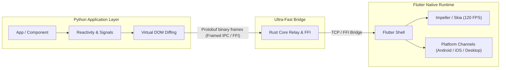

# Flarix (formerly PyFlutter) 🚀

[](https://pypi.org/project/flarix/)
[](https://flutter.dev)
[](LICENSE)
[](py_framework/tests)
[]()

**Flarix** is the ultra-fast, cross-platform bridge framework that empowers Python developers to build high-performance mobile, desktop, and web applications using Flutter's native 120 FPS engine.

Write pure, idiomatic Python with clean Object-Oriented components — get native Material 3 user interfaces running seamlessly on **Android, iOS, Windows, macOS, Linux, and Web**.

---

## ⚡ Why Flarix?

- 🐍 **100% Pythonic**: Write clean Object-Oriented components (`Component`, `StatefulComponent`), Signals, or Qt-style fluent widgets (`add_widget()`, `.clicked.connect()`).
- ⚡ **Native 120 FPS Performance**: Powered by a high-throughput Protobuf binary protocol and Rust FFI bridge.
- 🎨 **First-Class Material 3**: Beautiful widgets out-of-the-box (`AppBar`, `Card`, `FloatingActionButton`, `BottomNavigationBar`, `Slider`, `Badge`, `Chip`, `TextField`, etc.).
- 📦 **1-to-1 Flutter Plugin Ecosystem**: Every Flutter pub.dev package (`shared_preferences`, `path_provider`, `file_picker`, `device_info_plus`, `url_launcher`, `audioplayers`, `camera`) has a dedicated, matching Python module.
- 🚀 **Zero-Config Standalone Builds**: Build APKs, AppBundles, and desktop binaries directly with `pf.run(App(), build="apk")` or `python main.py build`.
- 🔄 **Incremental Virtual DOM Patching**: Sub-millisecond diffing sends only modified properties across the bridge instead of rebuilding the entire tree.

---

## 🏗️ Architecture



---

## 🚀 Quickstart

### 1. Installation

```bash
git clone https://github.com/flarix-ui/flarix.git
cd flarix/py_framework
pip install -e .
```

### 2. Create Your First App (`main.py`)

```python
import pyflutter as pf

class CounterApp(pf.Component):
    def __init__(self):
        super().__init__()
        self.count = 0

    def increment(self):
        self.count += 1
        self.update()  # Triggers instant reactive UI update

    def build(self):
        return pf.Scaffold(
            app_bar=pf.AppBar(
                title=pf.Text("Flarix Counter", color=pf.Colors.WHITE),
                background_color="#1877F2",
            ),
            body=pf.Center(
                pf.Card(
                    pf.Column([
                        pf.Text("Compteur", font_size=14, color=pf.Colors.GREY),
                        pf.SizedBox(height=8),
                        pf.Text(str(self.count), font_size=48, font_weight="bold"),
                        pf.SizedBox(height=16),
                        pf.ElevatedButton("+1", on_click=self.increment),
                    ], cross_axis_alignment="center"),
                    padding=24,
                    border_radius=16,
                )
            ),
            floating_action_button=pf.FloatingActionButton(
                icon=pf.Icons.ADD,
                on_click=self.increment,
            ),
        )

if __name__ == "__main__":
    # Run interactively on connected device or desktop:
    pf.run(CounterApp())

    # Or build an APK directly in Python:
    # pf.run(CounterApp(), build="apk", mode="debug")
```

### 3. Run or Build

```bash
# Run interactively (hot development)
python main.py

# Build Android APK (Debug by default)
python main.py build

# Build Android AppBundle for Google Play Store (Release)
python main.py build appbundle --release

# Build Windows Desktop executable
python main.py build windows --release
```

---

## 📱 Showcase Examples

The repository includes 3 production-grade reference applications in [`examples/`](file:///d:/Projets/PYFLUTTER/examples):

### 1. Modern Material 3 Counter ([`examples/counter`](file:///d:/Projets/PYFLUTTER/examples/counter))
A clean demonstration of component reactivity, button states, Material 3 card elevation, increment/decrement/reset, and floating action button.

```bash
cd examples/counter
python main.py
```

### 2. Social Media Feed ([`examples/facebook_feed`](file:///d:/Projets/PYFLUTTER/examples/facebook_feed))
Facebook-style social feed illustrating domain data modeling with `@dataclass`, reusable feed cards, like toggling, comment counters, interactive post publisher, and bottom tab navigation.

```bash
cd examples/facebook_feed
python main.py
```

### 3. PyShop E-Commerce Showcase ([`examples/pyshop`](file:///d:/Projets/PYFLUTTER/examples/pyshop))
An enterprise-grade e-commerce application demonstrating:
- **PyQt/PySide-style Object-Oriented layout assembly** (`add_widget()`, `add_spacing()`, QtSignals).
- **Material 3 Design System**: dynamic ColorScheme seed & Typography scale.
- **Catalog Filtering & Live Search**: query debounce and dynamic price range slider.
- **Reactive Shopping Cart**: live item counter badge, real-time total sum, and SnackBar notifications.
- **Remote Networking**: asynchronous catalog synchronization via background daemon thread with graceful offline fallback.
- **Native Mobile Integrations**: `url_launcher` (external browser, phone dialer, email).

```bash
cd examples/pyshop
python main.py
```

---

## 🔌 Native Plugins Ecosystem

Flarix maintains a **1-to-1 parity** with official Flutter packages on [pub.dev](https://pub.dev). Every Flutter plugin has a matching Python module under `pyflutter.plugins.*`:

| Flutter Pub Package | Python Module | Description |
|---|---|---|
| `shared_preferences` | `pyflutter.plugins.shared_preferences` | Key-value persistent storage |
| `path_provider` | `pyflutter.plugins.path_provider` | Native system directories (Documents, Temp, Downloads) |
| `file_picker` | `pyflutter.plugins.file_picker` | Native file & folder selection dialogs |
| `device_info_plus` | `pyflutter.plugins.device_info_plus` | Hardware, OS, processor, and device identifiers |
| `url_launcher` | `pyflutter.plugins.url_launcher` | Web browser, telephone calls, SMS, and email links |
| `audioplayers` | `pyflutter.plugins.audioplayers` | Background audio, effects, and sound playback |
| `share_plus` | `pyflutter.plugins.share_plus` | Native platform sharing sheets for text, URLs, and files |
| `webview_flutter` | `pyflutter.plugins.webview_flutter` | Embedded browser controller with JavaScript evaluation |
| `flutter_local_notifications` | `pyflutter.plugins.flutter_local_notifications` | Scheduled, immediate, and badge notifications |
| `flutter_secure_storage` | `pyflutter.plugins.flutter_secure_storage` | Hardware Keychain (iOS) and KeyStore (Android) |
| `syncfusion_flutter_pdfviewer` | `pyflutter.plugins.syncfusion_flutter_pdfviewer` | Enterprise PDF document viewer with zoom & pagination |
| `pdfx` | `pyflutter.plugins.pdfx` | Modern PDF rendering and pinch-to-zoom |
| `printing` | `pyflutter.plugins.printing` | Native print spooler, PDF generation, and layout |
| `camera` | `pyflutter.plugins.camera` | High-res camera enumeration, photo capture, video recording |

To add any custom package from pub.dev:
```bash
pyflutter add package_name
```

---

## 🛠️ CLI Reference

The `pyflutter` CLI provides a unified toolchain:

| Command | Arguments / Flags | Description |
|---|---|---|
| `pyflutter run` | `[entrypoint] [-d <device>] [-p <port>]` | Run app interactively on device or desktop |
| `pyflutter devices` | | List all detected Flutter physical devices & emulators |
| `pyflutter build` | `[target] [--debug\|--release] [--split-per-abi]` | Build standalone package (default: `apk`, mode: `debug`) |
| `pyflutter create` | `<name>` | Scaffold a new project with Material 3 template |
| `pyflutter init` | | Initialize a project in the current directory |
| `pyflutter sync` | | Sync `pyflutter.yaml` permissions to AndroidManifest/Info.plist |
| `pyflutter add` | `<package>` | Install a pub.dev package into the runtime |
| `pyflutter remove` | `<package>` | Uninstall a pub.dev package |

Supported build targets:
`apk`, `appbundle`, `windows`, `linux`, `macos`, `web`, `ipa`.

---

## 🧪 Testing & Reliability

The framework includes a comprehensive test suite covering the full lifecycle:
- Unit tests for component tree diffing, callback garbage collection, and state preservation.
- Full verification of native plugin shims and `MethodChannel` dispatch.
- Verification of CLI builder, argument forwarding, and entrypoint auto-discovery.

Run the test suite:
```bash
python -m unittest discover -s tests -p "test_*.py"
```
```text
Ran 137 tests in 0.160s
OK
```

---

## 🗺️ Roadmap & Renaming to Flarix

- [x] Full-duplex reactive IPC bridge (Protobuf + Rust)
- [x] Material 3 UI component catalog
- [x] Memory management with automated callback sweep & deterministic call-site keys
- [x] Native Flutter plugin connections (real SharedPreferences, PathProvider, FilePicker, DeviceInfo)
- [x] Standalone multi-platform builder pipeline (`python main.py build`)
- [ ] Official release on PyPI as `flarix`
- [ ] Official documentation portal at **`https://flarix.dev`**
- [ ] Hot-reload bridge daemon for sub-second code update during live development

---

## 📄 License

Licensed under the MIT License. See [LICENSE](LICENSE) for details.
