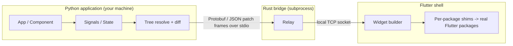

# PyFlutter

[](py_framework/pyproject.toml)
[](https://flutter.dev)
[]()

**PyFlutter** lets Python developers describe a user interface in Python and have it rendered by Flutter's native engine.
The Python application runs on your machine, a small Rust bridge relays messages, and a Flutter shell draws the widgets and calls native packages.

> **Status: alpha, development mode only.** The full loop (Python → Rust bridge → Flutter shell → callbacks back to Python, with hot reload) works while you develop on a connected device or desktop.
> Shipping a self-contained app that embeds Python is **not implemented yet** (see [What works today](#what-works-today)).
> The project is called *PyFlutter* in the code and the CLI; a rename (*Flarix*) is under consideration.

---

## Why PyFlutter?

- **Pythonic API**: `Component` / `StatefulComponent`, Signals, or Qt-style fluent widgets (`add_widget()`, `.clicked.connect()`).
- **Flutter's real renderer**: Material 3 widgets drawn by Flutter, not re-implemented.
- **Compact binary protocol**: Protobuf frames between Python, Rust and Dart; incremental patches instead of resending the whole tree when only properties change.
- **Packages on demand**: native Flutter packages are mapped to Python classes by hand-written shims (see [Native packages](#native-packages)); you only add the ones you use.

---

## Architecture



Native package calls travel the same way: Python sends `{plugin, method, args}`, a hand-written Dart shim calls the real package, and the answer comes back to the waiting Python call.

---

## What works today

| Area | State |
|------|-------|
| `pyflutter run` on Android / desktop devices with hot reload (`r`) and hot restart (`R`) | Works |
| Material widgets, reactive state, forms, navigation stack, SnackBar / dialogs | Works (coverage is partial, see `PYFLUTTER_VISION.md`) |
| Single UI thread: callbacks and builds never overlap, many updates cost one frame (`pf.run_on_ui` for your own threads) | Works |
| Incremental tree patches, reconnection resync, session token on the local socket | Works |
| Native packages (22 catalog plugins, see below) | Real shims calling the real Flutter packages; installed per project with `pyflutter add`. They compile (`flutter analyze`) individually and all together; they still need testing on devices |
| `hive` boxes and `sqflite` | Implemented in Python (JSON files, `sqlite3`), no Flutter package involved |
| Standalone app that embeds Python (APK / IPA / desktop bundle) | **Not implemented**: `pyflutter build` compiles the Flutter shell, but no Python interpreter is embedded yet |
| Web and iOS | **Not supported yet** (the shell imports `dart:io` / `dart:ffi`; iOS needs the embedded runtime) |
| Installation with `pip install` outside a repository clone | **Not available yet**: the CLI needs the `dart_runtime/` and `rust_bridge/` folders of this repository |

`AUDIT_BUGS.md` lists every known bug and missing piece with the planned fix.

---

## 🚀 Quickstart

### 1. Installation

```bash
git clone https://github.com/PerfectWin7777/pyflutter.git
cd pyflutter/py_framework
pip install -e .
```

### 2. Create Your First App (`main.py`)

```python
import pyflutter as pf

class CounterApp(pf.Component):
    def __init__(self):
        super().__init__()
        self.count = 0

    def increment(self):
        self.count += 1
        self.update()  # Triggers instant reactive UI update

    def build(self):
        return pf.Scaffold(
            app_bar=pf.AppBar(
                title=pf.Text("Counter", color=pf.Colors.WHITE),
                background_color="#1877F2",
            ),
            body=pf.Center(
                pf.Card(
                    pf.Column([
                        pf.Text("Compteur", font_size=14, color=pf.Colors.GREY),
                        pf.SizedBox(height=8),
                        pf.Text(str(self.count), font_size=48, font_weight="bold"),
                        pf.SizedBox(height=16),
                        pf.ElevatedButton("+1", on_click=self.increment),
                    ], cross_axis_alignment="center"),
                    padding=24,
                    border_radius=16,
                )
            ),
            floating_action_button=pf.FloatingActionButton(
                icon=pf.Icons.ADD,
                on_click=self.increment,
            ),
        )

if __name__ == "__main__":
    # Run interactively on a connected device or desktop (development mode):
    pf.run(CounterApp())
```

### 3. Run

```bash
# Run interactively with hot reload (needs the Rust bridge built once: see Requirements)
python main.py            # or: pyflutter run main.py

# Flutter shell build (does NOT embed Python yet)
pyflutter build apk --release
pyflutter build windows --release
```

### Requirements

- Python 3.10+
- Flutter SDK (3.32 or newer) in `PATH`, and a device, emulator or desktop target (`pyflutter devices`)
- Rust toolchain and `protoc` to build the bridge once: `cargo build --manifest-path rust_bridge/Cargo.toml`
- Android: Android SDK / NDK as required by Flutter

---

## Showcase examples

See [`examples/`](examples):

- [`examples/counter`](examples/counter): Material 3 counter with a FloatingActionButton.
- [`examples/facebook_feed`](examples/facebook_feed): social feed with dataclasses, like toggling, bottom navigation.
- [`examples/pyshop`](examples/pyshop): e-commerce showcase (Qt-style layouts, live search, reactive cart, SnackBars, `url_launcher`).

```bash
cd examples/counter
python main.py
```

---

## Native packages

PyFlutter does **not** try to expose every pub.dev package automatically, and it does not put
every package in every app. The model is:

1. Each supported package has an entry in [`dart_runtime/plugin_catalog/`](dart_runtime/plugin_catalog): a `plugin.yaml`
   (package, version, native settings) and a hand-written Dart shim that calls the real package API.
2. A Python module `pyflutter.plugins.<package>` mirrors the package's classes and methods.
3. A project lists the plugins it uses in `pyflutter.yaml` (`plugins:`); `pyflutter add <name>` edits that list and wires the
   shim, the `pubspec.yaml` dependency and the native Android settings. Only those packages are compiled into the app.

```bash
pyflutter plugin list                 # catalog and what this project uses
pyflutter add local_auth              # install a catalog plugin
pyflutter add some_other_package      # no shim yet: adds the Flutter dependency, then
pyflutter plugin new some_other_package   # scaffolds the shim, Python module and test to fill from the package docs
pyflutter remove local_auth
```

A plugin that is not installed fails with a clear error (`Plugin "x" is not installed in this runtime. Install it with: pyflutter add x`).
When a Flutter runtime is connected, a plugin error or timeout raises `PluginError` / `PluginTimeoutError`; it is never
replaced by simulated data, and a missing or malformed answer never reads as a success.

| Plugin (pub.dev package) | Python module | Notes |
|---|---|---|
| `shared_preferences`, `path_provider`, `device_info_plus`, `url_launcher`, `file_picker` | `pyflutter.plugins.<name>` | Key-value storage, system folders, device info, links/phone/email, file and folder dialogs |
| `connectivity_plus`, `share_plus`, `image_picker`, `audioplayers` | `pyflutter.plugins.<name>` | Network state, share sheet, gallery/camera picking, audio playback |
| `flutter_local_notifications` | `pyflutter.plugins.flutter_local_notifications` | Show / cancel notifications (needs core library desugaring, applied automatically) |
| `local_auth`, `permission_handler`, `flutter_secure_storage` | `pyflutter.plugins.<name>` | Biometrics, runtime permissions, encrypted storage |
| `camera`, `video_player`, `chewie`, `webview_flutter` | `pyflutter.plugins.<name>` | Real widgets `CameraPreview`, `VideoPlayer`, `Chewie`, `WebView` |
| `syncfusion_flutter_pdfviewer`, `pdfx`, `flutter_pdfview`, `printing` | `pyflutter.plugins.<name>` | PDF viewers (`SfPdfViewer`, `PdfView`, `PDFView`), page rendering, print and share. Syncfusion needs its own licence |
| `hive`, `sqflite` | `pyflutter.plugins.hive`, `pyflutter.plugins.sqflite` | Pure Python (JSON boxes, `sqlite3`), no Flutter package |

Without a connected Flutter runtime (unit tests, scripts) plugin calls use a small local simulation so code can be tested offline.

To check a catalog change: `python tools/verify_catalog.py` (needs the Flutter SDK) installs every plugin into a temporary copy of the
runtime, runs `flutter pub get` and `flutter analyze`, then installs them all together to catch version conflicts.

---

## CLI reference

| Command | Arguments / flags | Description |
|---|---|---|
| `pyflutter run` | `[entrypoint] [-d <device>] [-p <port>] [--attach]` | Run the app interactively on a device or desktop |
| `pyflutter devices` | | List devices and emulators detected by Flutter |
| `pyflutter build` | `[target] [--debug\|--release\|--profile] [--split-per-abi]` | Build the Flutter shell (default: `apk`, debug). No embedded Python yet |
| `pyflutter create` | `<name>` | Scaffold a project |
| `pyflutter init` | | Initialise a project in the current directory |
| `pyflutter sync` | | Sync `pyflutter.yaml` permissions to the Android manifest and iOS plist |
| `pyflutter add` | `<package>` | Install a catalog plugin (or add a Flutter package that has no shim yet) |
| `pyflutter remove` | `<package>` | Remove a plugin / package |
| `pyflutter plugin` | `list` \| `new <package>` | List the plugin catalog, or scaffold the mapping of a new package |

Build targets: `apk`, `appbundle`, `windows`, `linux`, `macos`, `web`, `ipa` (`web` and `ipa` are not supported yet, see above).

---

## Tests

```bash
pip install pytest protobuf loguru pyyaml
cd py_framework
python -m pytest -q
```

The Rust relay tests (`tests/test_bridge_relay.py`) run the real bridge binary and are skipped when it is not built. The Dart runtime has no automated tests yet.

---

## Roadmap

- [x] Duplex reactive bridge (Protobuf frames, Rust relay, Flutter shell) in development mode
- [x] Material 3 widget catalog (partial coverage)
- [x] Callback lifecycle (sweep, pinned one-shot callbacks), deterministic state keys
- [x] Hot reload / hot restart, reconnection resync
- [x] Packages on demand (`pyflutter add` with a plugin catalog)
- [ ] Per-project copy of the Flutter runtime (today `pyflutter add` edits the repository's `dart_runtime/`)
- [ ] Embedded Python interpreter for standalone builds
- [ ] Pip distribution with a prebuilt bridge
- [ ] Hot reload of every project module, file watcher
- [ ] Documentation site

The detailed, ordered plan is in [`AUDIT_BUGS.md`](AUDIT_BUGS.md).

---

## License

MIT (the `LICENSE` file is still to be added).
